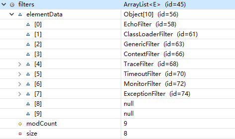

# Protocol接口源码分析

```java
@SPI("dubbo")//SPI注解里面有默认名字
public interface Protocol {
    int getDefaultPort();

    /**
     * 暴露服务给远程执行: <br>
     * 1. 协议应当记录请求源地址: RpcContext.getContext().setRemoteAddress();
     * 2. export()应当幂等，对同一个URL进行暴露服务，无论执行多少次export()都应该是幂等的<br>
     * 3. 调用程序实例由框架传入，协议不需要关心 <br>
     */
    @Adaptive
    <T> Exporter<T> export(Invoker<T> invoker) throws RpcException;

    /**
     * Refer a remote service: <br>
     * 1. When user calls `invoke()` method of `Invoker` object which's returned from `refer()` call, the protocol
     * needs to correspondingly execute `invoke()` method of `Invoker` object <br>
     * 2. It's protocol's responsibility to implement `Invoker` which's returned from `refer()`. Generally speaking,
     * protocol sends remote request in the `Invoker` implementation. <br>
     * 3. When there's check=false set in URL, the implementation must not throw exception but try to recover when
     * connection fails.
     *
     * @param <T>  Service type
     * @param type Service class
     * @param url  URL address for the remote service
     * @return invoker service's local proxy
     * @throws RpcException when there's any error while connecting to the service provider
     */
    @Adaptive
    <T> Invoker<T> refer(Class<T> type, URL url) throws RpcException;

    /**
     * Destroy protocol: <br>
     * 1. Cancel all services this protocol exports and refers <br>
     * 2. Release all occupied resources, for example: connection, port, etc. <br>
     * 3. Protocol can continue to export and refer new service even after it's destroyed.
     */
    void destroy();

}
```

### Protocol接口具体实现：

- filter=com.alibaba.dubbo.rpc.protocol.ProtocolFilterWrapper
- listener=com.alibaba.dubbo.rpc.protocol.ProtocolListenerWrapper
- mock=com.alibaba.dubbo.rpc.support.MockProtocol
- dubbo=com.alibaba.dubbo.rpc.protocol.dubbo.DubboProtocol
- injvm=com.alibaba.dubbo.rpc.protocol.injvm.InjvmProtocol
- rmi=com.alibaba.dubbo.rpc.protocol.rmi.RmiProtocol
- hessian=com.alibaba.dubbo.rpc.protocol.hessian.HessianProtocol
- com.alibaba.dubbo.rpc.protocol.http.HttpProtocol
- com.alibaba.dubbo.rpc.protocol.webservice.WebServiceProtocol
- thrift=com.alibaba.dubbo.rpc.protocol.thrift.ThriftProtocol
- memcached=com.alibaba.dubbo.rpc.protocol.memcached.MemcachedProtocol
- redis=com.alibaba.dubbo.rpc.protocol.redis.RedisProtocol
- rest=com.alibaba.dubbo.rpc.protocol.rest.RestProtocol
- registry=com.alibaba.dubbo.registry.integration.RegistryProtocol
- qos=com.alibaba.dubbo.qos.protocol.QosProtocolWrapper

这些实现类里面没有任何一个类有@Adaptive注解，所以最终ExtensionLoader会自动创建Adaptive类，并且会自动创建嵌套包装类对象（而且包装类对象会执行ExtensionLoader的injectExtension操作）

###ProtocolFilterWrapper源码分析

```java
public class ProtocolFilterWrapper implements Protocol {
    private final Protocol protocol;
    /**
     * 因为ProtocolFilterWrapper类有一个参数的构造方法，并且方法参数为其接口子类对象，所以这个会被当成wrapper类
     */
    public ProtocolFilterWrapper(Protocol protocol) {
        if (protocol == null) {
            throw new IllegalArgumentException("protocol == null");
        }
        this.protocol = protocol;
    }
    /**注意这个方法获取Filter所有的Activate子类，构造一个嵌套的invoke执行链*/
    private static <T> Invoker<T> buildInvokerChain(final Invoker<T> invoker, String key, String group) {
        Invoker<T> last = invoker;
        List<Filter> filters = ExtensionLoader.getExtensionLoader(Filter.class).getActivateExtension(invoker.getUrl(), key, group);
        if (!filters.isEmpty()) {
            for (int i = filters.size() - 1; i >= 0; i--) {
                final Filter filter = filters.get(i);
                final Invoker<T> next = last;
                last = new Invoker<T>() {
                    @Override
                    public Class<T> getInterface() {
                        return invoker.getInterface();
                    }
                    @Override
                    public URL getUrl() {
                        return invoker.getUrl();
                    }
                    @Override
                    public boolean isAvailable() {
                        return invoker.isAvailable();
                    }
                    @Override
                    public Result invoke(Invocation invocation) throws RpcException {
                        return filter.invoke(next, invocation);
                    }
                    @Override
                    public void destroy() {
                        invoker.destroy();
                    }
                    @Override
                    public String toString() {
                        return invoker.toString();
                    }
                };
            }
        }
        return last;
    }

    @Override
    public int getDefaultPort() {
        return protocol.getDefaultPort();
    }

    @Override
    public <T> Exporter<T> export(Invoker<T> invoker) throws RpcException {
        if (Constants.REGISTRY_PROTOCOL.equals(invoker.getUrl().getProtocol())) {
            return protocol.export(invoker);
        }
        return protocol.export(buildInvokerChain(invoker, Constants.SERVICE_FILTER_KEY, Constants.PROVIDER));
    }

    @Override
    public <T> Invoker<T> refer(Class<T> type, URL url) throws RpcException {
        if (Constants.REGISTRY_PROTOCOL.equals(url.getProtocol())) {
            return protocol.refer(type, url);
        }
        return buildInvokerChain(protocol.refer(type, url), Constants.REFERENCE_FILTER_KEY, Constants.CONSUMER);
    }

    @Override
    public void destroy() {
        protocol.destroy();
    }

}
```

注意上面的buildInvokerChain是从filters列表最后一个开始




需要重点注意这几个类：

ExceptionFilter:server端执行过程中如果抛异常，分以下几种情况

> 1、如果不是RuntimeException并且是Exception，则直接返回给client
>```java
>  if (!(exception instanceof RuntimeException) && (exception instanceof Exception)) {
>       return result;
> }
>```
>
> 2、如果是那种在方法后面事先声明了的异常，如User getUser(String name) throws CustomException类似这种，那么这个也会原模原样返回给client，然而client端可能没有这个CustomException自定义异常，最后会抛出java.lang.ClassNotFoundException（亲测会抛异常）
>```java
> Class<?>[] exceptionClassses = method.getExceptionTypes();
> for (Class<?> exceptionClass : exceptionClassses) {
>   if (exception.getClass().equals(exceptionClass)) {
>      return result;
>   }
> }
>```
> 3、如果异常类型是JDK自带的异常，也就是异常类型是java.xxx.xxx这种，这个也会原样返回给client
>
> 4、如果是RpcException类型或者RpcException子类类型，则原样返回给client
>
> 5、如果不是上述情况，则一律封装成RuntimeException返回给client


MonitorFilter: 这个类里面会监控server端的执行情况，并通过scheduledExecutorService定期send一些关键指标信息，一般是推送到zookeeper里面，不过这需要用户在代码里面设置monitor

TimeoutFilter:这个就是server端判断执行有没有超时，一般url里面会带有timeout参数

TraceFilter:这个从字面上理解就是用来追踪执行过程的，但是源码很简单，就是获取到TCP连接channel，然后设置channel.setAttribute(TRACE_COUNT, c);并且给channel发送一条消息
