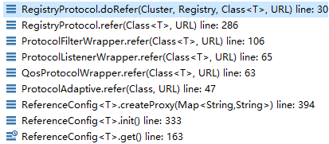
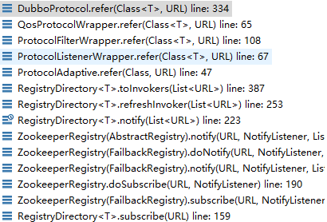
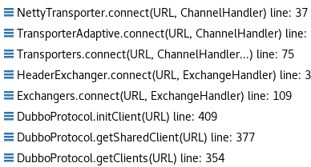
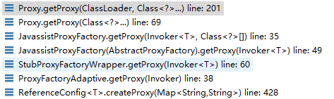

# ReferenceConfig原理分析

- 执行链从ReferenceConfig.get()开始

ReferenceConfig.get() ------> ReferenceConfig.init() ------> ReferenceConfig.createProxy(map)

- 功能核心就在createProxy(map)里面

首先，如果server端和client端都开启了injvm配置，则client优先从当前jvm进程内部寻找RPC服务，如果找不到则通过registry寻找RPC服务，并通过长连接进行RPC通信

1. 首先通过refprotocol.refer(interfaceClass, url)获取一个invoker对象，这里的refprotocol是一个Adaptive类，所以我自己为了调试方便，单独把这个动态类源码导出来，执行链如下：

   

2. 上面会自动执行到RegistryProtocol的doRefer方法

```java
private <T> Invoker<T> doRefer(Cluster cluster, Registry registry, Class<T> type, URL url) {
    //创建一个RegistryDirectory对象
    RegistryDirectory<T> directory = new RegistryDirectory<T>(type, url);
    //这里registry一般是ZookeeperRegistry
    directory.setRegistry(registry);
    //这里protocol是Protocol接口的Adaptive类对象
    directory.setProtocol(protocol);
    // all attributes of REFER_KEY
    Map<String, String> parameters = new HashMap<String, String>(directory.getUrl().getParameters());
    URL subscribeUrl = new URL(Constants.CONSUMER_PROTOCOL, parameters.remove(Constants.REGISTER_IP_KEY), 0, type.getName(), parameters);
    if (!Constants.ANY_VALUE.equals(url.getServiceInterface())
            && url.getParameter(Constants.REGISTER_KEY, true)) {
        //将consumer信息注册到registry里面
        registry.register(subscribeUrl.addParameters(Constants.CATEGORY_KEY, Constants.CONSUMERS_CATEGORY,
                Constants.CHECK_KEY, String.valueOf(false)));
    }
    //将zookeeper的znode抽象为一个directory，这里执行的就是监听这个znode下面的服务路径变化情况
    directory.subscribe(subscribeUrl.addParameter(Constants.CATEGORY_KEY,
            Constants.PROVIDERS_CATEGORY
                    + "," + Constants.CONFIGURATORS_CATEGORY
                    + "," + Constants.ROUTERS_CATEGORY));
    //cluster默认的Adaptive类为FailoverCluster，这里会返回FailoverClusterInvoker对象并封装了RegistryDirectory
    Invoker invoker = cluster.join(directory);
    ProviderConsumerRegTable.registerConsumer(invoker, url, subscribeUrl, directory);
    return invoker;
}
```

2.1上面的directory.subscribe执行了如下操作：



在这里DubboProtocol的refer方法返回了一个DubboInvoker对象，并且这个invoker对象加入到了一个invokers集合里面，这里的getClients(url)会和RPC服务端建立长连接，注意里面RegistryDirectory的toInvokers方法里面入参是zookeeper里面注册的某一类服务所有url，如一个服务有多副本，分布在不同主机，然后注册到zookeeper都是在同一个path下面，这里消费者端会全部读出来并利用for循环和每个副本创建一个DubboInvoker对象，每个DubboInvoker对象和服务端副本都有长连接

```java
@Override
public <T> Invoker<T> refer(Class<T> serviceType, URL url) throws RpcException {
    optimizeSerialization(url);
    // create rpc invoker.
    DubboInvoker<T> invoker = new DubboInvoker<T>(serviceType, url, getClients(url), invokers);
    invokers.add(invoker);
    return invoker;
}
```
getClients(url)执行链如下所示，本质上就是创建一个NettyClient对象，这个对象用于与RPC服务端连接



2.2注意上面的RegistryDirectory.toInvokers(invokerUrls)方法会将前面DubboProtocol.refer返回的DubboInvoker封装成一个InvokerDelegate对象，然后会放入一个Map对象里面，map最终会赋值给RegistryDirectory的urlInvokerMap属性

2.3接着分析Invoker invoker = cluster.join(directory)，在这里cluster也是一个Adaptive类对象，我自己导出了这个类源码用于断点调试，这个类默认的实现是FailoverCluster，这里会返回一个FailoverClusterInvoker对象并封装了RegistryDirectory

3.从流程2就能够返回一个invoker对象，这个对象是一个FailoverClusterInvoker对象，接下来执行createProxy(map)的后半段操作

4.流程3获得的invoker对象还需要经过proxyFactory.getProxy(invoker)才会最终返回一个代理对象，执行链如下：



这里最终都是通过动态代理技术创建一个代理类以及对象，本质上最终代理类对象各种操作都是操作这个invoker对象
