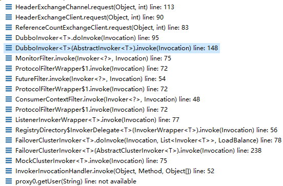

# ReferenceConfig原理分析

- 执行链从ReferenceConfig.get()开始

ReferenceConfig.get() ------> ReferenceConfig.init() ------> ReferenceConfig.createProxy(map)

- 功能核心就在createProxy(map)里面

首先，如果server端和client端都开启了injvm配置，则client优先从当前jvm进程内部寻找RPC服务，如果找不到则通过registry寻找RPC服务，并通过长连接进行RPC通信

1. 首先通过refprotocol.refer(interfaceClass, url)获取一个invoker对象，这里的refprotocol是一个Adaptive类，所以我自己为了调试方便，单独把这个动态类源码导出来，执行链如下：

   

2. 上面会自动执行到RegistryProtocol的doRefer方法

```java
private <T> Invoker<T> doRefer(Cluster cluster, Registry registry, Class<T> type, URL url) {
    //创建一个RegistryDirectory对象
    RegistryDirectory<T> directory = new RegistryDirectory<T>(type, url);
    //这里registry一般是ZookeeperRegistry
    directory.setRegistry(registry);
    //这里protocol是Protocol接口的Adaptive类对象
    directory.setProtocol(protocol);
    // all attributes of REFER_KEY
    Map<String, String> parameters = new HashMap<String, String>(directory.getUrl().getParameters());
    URL subscribeUrl = new URL(Constants.CONSUMER_PROTOCOL, parameters.remove(Constants.REGISTER_IP_KEY), 0, type.getName(), parameters);
    if (!Constants.ANY_VALUE.equals(url.getServiceInterface())
            && url.getParameter(Constants.REGISTER_KEY, true)) {
        //将consumer信息注册到registry里面
        registry.register(subscribeUrl.addParameters(Constants.CATEGORY_KEY, Constants.CONSUMERS_CATEGORY,
                Constants.CHECK_KEY, String.valueOf(false)));
    }
    //将zookeeper的znode抽象为一个directory，这里执行的就是监听这个znode下面的服务路径变化情况
    directory.subscribe(subscribeUrl.addParameter(Constants.CATEGORY_KEY,
            Constants.PROVIDERS_CATEGORY
                    + "," + Constants.CONFIGURATORS_CATEGORY
                    + "," + Constants.ROUTERS_CATEGORY));
    //cluster默认的Adaptive类为FailoverCluster，这里会返回FailoverClusterInvoker对象并封装了RegistryDirectory
    Invoker invoker = cluster.join(directory);
    ProviderConsumerRegTable.registerConsumer(invoker, url, subscribeUrl, directory);
    return invoker;
}
```

2.1上面的directory.subscribe执行了如下操作：


从RegistryDirectory的notify方法开始，接下来会执行refreshInvoker方法，这个方法里面主要执行了两个操作，一个是toInvokers(invokerUrls)方法，注意这个方法里面传入的参数url数组是zookeeper里面一个服务所对应的多个副本的url（比如一个provider有多个副本，那么都会注册到同一个zookeeper的path下面，每个单独的服务都有唯一的url对应，通过这个url，consumer就能直连provider），传入url数组之后会通过for循环遍历，每一次循环内部执行一次mergeUrl操作，mergeUrl执行的是configurator.configure(providerUrl)，前提是配置了configurator，据官网描述，configurator用来给监控配置服务的，如配置服务降级、在线配置服务参数而无需重启服务，configurator执行完之后，consumer端需要与这个url连接，也就是连接provider并返回一个invoker对象，最后这个invoker对象添加到newUrlInvokerMap里面，言外之意就是说，在consumer端会通过长连接连到每一个provider副本，这样后续就能实现动态负载。


refreshInvoker方法里面执行的另一个操作是toMethodInvokers(newUrlInvokerMap)，这个toMethodInvokers(newUrlInvokerMap)方法主要是对toInvokers(invokerUrls)返回的invoker对象进行筛选，也就是配置路由的功能，Router对象需要用户自己定义筛选规则，默认Router是MockInvokersSelector


接下来分析DubboProtocol，DubboProtocol的refer方法返回了一个DubboInvoker对象，并且这个invoker对象加入到了一个invokers集合里面，这里的getClients(url)会和RPC服务端建立长连接，注意里面RegistryDirectory的toInvokers方法里面入参是zookeeper里面注册的某一类服务所有url，如一个服务有多副本，分布在不同主机，然后注册到zookeeper都是在同一个path下面，这里消费者端会全部读出来并利用for循环和每个副本创建一个DubboInvoker对象，每个DubboInvoker对象和服务端副本都有长连接

```java
@Override
public <T> Invoker<T> refer(Class<T> serviceType, URL url) throws RpcException {
    optimizeSerialization(url);
    // create rpc invoker.
    DubboInvoker<T> invoker = new DubboInvoker<T>(serviceType, url, getClients(url), invokers);
    invokers.add(invoker);
    return invoker;
}
```
getClients(url)执行链如下所示，本质上就是创建一个NettyClient对象，这个对象用于与RPC服务端连接


2.2注意上面的RegistryDirectory.toInvokers(invokerUrls)方法会将前面DubboProtocol.refer返回的DubboInvoker封装成一个InvokerDelegate对象，然后会放入一个Map对象里面，map最终会赋值给RegistryDirectory的urlInvokerMap属性

2.3接着分析Invoker invoker = cluster.join(directory)，在这里cluster也是一个Adaptive类对象，我自己导出了这个类源码用于断点调试，这个类默认的实现是FailoverCluster，这里会返回一个FailoverClusterInvoker对象并封装了RegistryDirectory

3.从流程2就能够返回一个invoker对象，这个对象是一个FailoverClusterInvoker对象，接下来执行createProxy(map)的后半段操作

4.流程3获得的invoker对象还需要经过proxyFactory.getProxy(invoker)才会最终返回一个代理对象，执行链如下：


这里最终都是通过动态代理技术创建一个代理类以及对象，本质上最终代理类对象各种操作都是操作这个invoker对象


# ReferenceConfig执行远程调用原理

1.通过断点调试，远程调用执行链如下：



2.从AbstractInvoker.invoke(invocation)开始，因为前面的一大串Filter链都不难

```java
    @Override
    public Result invoke(Invocation inv) throws RpcException {
        //........
        /*
        * 这里有一段没什么意义的代码，主要执行的是一个给inv参数设置一些属性值
        */
        try {
            return doInvoke(invocation);//核心是从doInvoke开始
        } catch (InvocationTargetException e) { // biz exception
            Throwable te = e.getTargetException();
            if (te == null) {
                return new RpcResult(e);
            } else {
                if (te instanceof RpcException) {
                    ((RpcException) te).setCode(RpcException.BIZ_EXCEPTION);
                }
                return new RpcResult(te);
            }
        } catch (RpcException e) {
            if (e.isBiz()) {
                return new RpcResult(e);
            } else {
                throw e;
            }
        } catch (Throwable e) {
            return new RpcResult(e);
        }
    }
```

3.前面那里接着会执行到DubboInvoker.doInvoke(invocation)方法里面，这里面干了如下几件事：

```java
@Override
protected Result doInvoke(final Invocation invocation) throws Throwable {
    RpcInvocation inv = (RpcInvocation) invocation;
    final String methodName = RpcUtils.getMethodName(invocation);
    inv.setAttachment(Constants.PATH_KEY, getUrl().getPath());
    inv.setAttachment(Constants.VERSION_KEY, version);

    ExchangeClient currentClient;
    if (clients.length == 1) {//如果和RPC服务端只有一个连接
        currentClient = clients[0];
    } else {
        currentClient = clients[index.getAndIncrement() % clients.length];
    }
    try {
        boolean isAsync = RpcUtils.isAsync(getUrl(), invocation);
        boolean isOneway = RpcUtils.isOneway(getUrl(), invocation);
        int timeout = getUrl().getMethodParameter(methodName, Constants.TIMEOUT_KEY, Constants.DEFAULT_TIMEOUT);
        if (isOneway) {//这种是单向的请求，无需等待对方返回结果
            boolean isSent = getUrl().getMethodParameter(methodName, Constants.SENT_KEY, false);
            currentClient.send(inv, isSent);
            RpcContext.getContext().setFuture(null);
            return new RpcResult();
        } else if (isAsync) {//这种是异步执行
            ResponseFuture future = currentClient.request(inv, timeout);
            RpcContext.getContext().setFuture(new FutureAdapter<Object>(future));
            return new RpcResult();
        } else {
            RpcContext.getContext().setFuture(null);
            return (Result) currentClient.request(inv, timeout).get();//一般是走到这里
        }
    } catch (TimeoutException e) {
        throw new RpcException(RpcException.TIMEOUT_EXCEPTION, "Invoke remote method timeout. method: " + invocation.getMethodName() + ", provider: " + getUrl() + ", cause: " + e.getMessage(), e);
    } catch (RemotingException e) {
        throw new RpcException(RpcException.NETWORK_EXCEPTION, "Failed to invoke remote method: " + invocation.getMethodName() + ", provider: " + getUrl() + ", cause: " + e.getMessage(), e);
    }
}
```

注意上面(Result) currentClient.request(inv, timeout).get()这个调用，currentClient本身是一个ReferenceCountExchangeClient，currentClient.request(inv, timeout)会返回一个future对象，ReferenceCountExchangeClient的request方法本质上执行了HeaderExchangeChannel的request方法，这个方法会执行两个动作：

```java
@Override
public ResponseFuture request(Object request, int timeout) throws RemotingException {
    if (closed) {
        throw new RemotingException(this.getLocalAddress(), null, "Failed to send request " + request + ", cause: The channel " + this + " is closed!");
    }
    // create request.
    Request req = new Request();//封装一个request对象，这个对象有一个全局唯一递增的id，重点关注
    req.setVersion("2.0.0");
    req.setTwoWay(true);
    req.setData(request);
    DefaultFuture future = new DefaultFuture(channel, req, timeout);//封装一个future对象
    try {
        channel.send(req);//把req对象发送到RPC服务端
    } catch (RemotingException e) {
        future.cancel();
        throw e;
    }
    return future;//返回这个future对象
}
```

上方的代码注意Request对象，这个对象在构造方法里面会初始化一个id，这个id是一个静态AtomicLong不断叠加的返回值，保证全局并发唯一并且递增，接着封装为一个DefaultFuture，channel发送这个request对象到RPC服务端，最后返回这个DefaultFuture，最终通过currentClient.request(inv, timeout).get()阻塞直到RPC服务端返回结果


下面分析DefaultFuture执行了什么操作：

```java
public DefaultFuture(Channel channel, Request request, int timeout) {
    this.channel = channel;
    this.request = request;
    this.id = request.getId();//获取request的唯一id
    this.timeout = timeout > 0 ? timeout : channel.getUrl().getPositiveParameter(Constants.TIMEOUT_KEY, Constants.DEFAULT_TIMEOUT);//初始化一个超时时间
    // put into waiting map.
    FUTURES.put(id, this);
    CHANNELS.put(id, channel);
}
```

首先初始化自己，然后把自己放入一个静态成员FUTURES里面，channel放入CHANNELS静态变量里面，key都是前面那个request的id属性（这个id全局递增且每个request全局唯一）


DefaultFuture的get()方法如下：

```java
@Override
public Object get() throws RemotingException {
    return get(timeout);
}

@Override
public Object get(int timeout) throws RemotingException {
    if (timeout <= 0) {
        timeout = Constants.DEFAULT_TIMEOUT;
    }
    if (!isDone()) {
        long start = System.currentTimeMillis();
        lock.lock();
        try {
            while (!isDone()) {
                done.await(timeout, TimeUnit.MILLISECONDS);//在这里
                if (isDone() || System.currentTimeMillis() - start > timeout) {
                    break;
                }
            }
        } catch (InterruptedException e) {
            throw new RuntimeException(e);
        } finally {
            lock.unlock();
        }
        if (!isDone()) {
            throw new TimeoutException(sent > 0, channel, getTimeoutMessage(false));
        }
    }
    return returnFromResponse();
}
```

从上面的代码可以看出，DefaultFuture的get()方法主要是让当前线程进入阻塞状态，等到下次接收到RPC服务端返回的数据之后触发received方法

```java
public static void received(Channel channel, Response response) {
    try {
        DefaultFuture future = FUTURES.remove(response.getId());//注意这里
        if (future != null) {
            future.doReceived(response);//执行下面的doReceived方法
        } else {
            logger.warn("The timeout response finally returned at "
                    + (new SimpleDateFormat("yyyy-MM-dd HH:mm:ss.SSS").format(new Date()))
                    + ", response " + response
                    + (channel == null ? "" : ", channel: " + channel.getLocalAddress()
                    + " -> " + channel.getRemoteAddress()));
        }
    } finally {
        CHANNELS.remove(response.getId());
    }
}

private void doReceived(Response res) {
    lock.lock();
    try {
        response = res;
        if (done != null) {
            done.signal();
        }
    } finally {
        lock.unlock();
    }
    if (callback != null) {
        invokeCallback(callback);
    }
}
```

注意上面的DefaultFuture future = FUTURES.remove(response.getId())，这里面利用到了response的id属性，这个是服务的执行结束之后返回的，其中那个id就是之前的request对象的id，所以这里返回的是FUTURES里面那个key对应的DefaultFuture对象，然后执行下面的doReceived，在这里就唤醒了前面一直阻塞的get()方法，这样就解释通了为什么消费者端发送的多次请求与响应数据能够保持一一对应关系