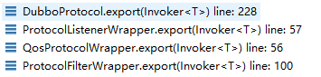

# ServiceConfig原理分析

###ServiceConfig

需注意两个内部属性：

```java
private static final Protocol protocol = ExtensionLoader.getExtensionLoader(Protocol.class).getAdaptiveExtension();

private static final ProxyFactory proxyFactory = ExtensionLoader.getExtensionLoader(ProxyFactory.class).getAdaptiveExtension();
```

> 由于Protocol接口和ProxyFactory接口没有具体的Adaptive实现类，所以getAdaptiveExtension()会为这两个接口创建Adaptive类，因为Adaptive类不好调试，所以我把生成的Adaptive类源代码手工创建一个类，这样被dubbo自动扫描到就好调试了


执行流程：export()---->doExport()---->doExportUrls()---->doExportUrlsFor1Protocol(protocolConfig, registryURLs)

- 重点关注doExportUrls()执行流程

```java
    @SuppressWarnings({"unchecked", "rawtypes"})
    private void doExportUrls() {
        //把registries信息转换成URL对象数组
        List<URL> registryURLs = loadRegistries(true);
        for (ProtocolConfig protocolConfig : protocols) {
            doExportUrlsFor1Protocol(protocolConfig, registryURLs);
        }
    }
```

loadRegistries(true)方法将配置好的registry信息转换成一个个URL对象，URL的大致内容如下：

> registry://192.168.1.120:2181/com.alibaba.dubbo.registry.RegistryService?application=server&client=zkclient&dubbo=2.6.2&pid=11880&qos.accept.foreign.ip=false&qos.enable=true&qos.port=33333&registry=zookeeper&timestamp=1552484682709
>


接下来doExportUrlsFor1Protocol方法主要干了两件事：

如果设置了scope为null或者local，则会exportLocal(url)暴露本地服务；

最后会暴露远程服务（暴露过程中需要注册到registry）

```java
if (!Constants.SCOPE_REMOTE.toString().equalsIgnoreCase(scope)) {
    exportLocal(url);//暴露本地服务
}
// export to remote if the config is not local (export to local only when config is local)
if (!Constants.SCOPE_LOCAL.toString().equalsIgnoreCase(scope)) {
    if (logger.isInfoEnabled()) {
        logger.info("Export dubbo service " + interfaceClass.getName() + " to url " + url);
    }
    if (registryURLs != null && !registryURLs.isEmpty()) {
        for (URL registryURL : registryURLs) {
            url = url.addParameterIfAbsent(Constants.DYNAMIC_KEY, registryURL.getParameter(Constants.DYNAMIC_KEY));
            URL monitorUrl = loadMonitor(registryURL);
            if (monitorUrl != null) {
                url = url.addParameterAndEncoded(Constants.MONITOR_KEY, monitorUrl.toFullString());
            }
            if (logger.isInfoEnabled()) {
                logger.info("Register dubbo service " + interfaceClass.getName() + " url " + url + " to registry " + registryURL);
            }
            Invoker<?> invoker = proxyFactory.getInvoker(ref, (Class) interfaceClass, registryURL.addParameterAndEncoded(Constants.EXPORT_KEY, url.toFullString()));
            DelegateProviderMetaDataInvoker wrapperInvoker = new DelegateProviderMetaDataInvoker(invoker, this);

            Exporter<?> exporter = protocol.export(wrapperInvoker);
            exporters.add(exporter);
        }
    } else {
        Invoker<?> invoker = proxyFactory.getInvoker(ref, (Class) interfaceClass, url);
        DelegateProviderMetaDataInvoker wrapperInvoker = new DelegateProviderMetaDataInvoker(invoker, this);

        Exporter<?> exporter = protocol.export(wrapperInvoker);
        exporters.add(exporter);
    }
}
```

其中proxyFactory.getInvoker最终会执行到JavassistProxyFactory类里面的getInvoker方法，这里需要注意，如下所示：

```java
public class JavassistProxyFactory extends AbstractProxyFactory {

    @Override
    @SuppressWarnings("unchecked")
    public <T> T getProxy(Invoker<T> invoker, Class<?>[] interfaces) {
        return (T) Proxy.getProxy(interfaces).newInstance(new InvokerInvocationHandler(invoker));
    }

    @Override
    public <T> Invoker<T> getInvoker(T proxy, Class<T> type, URL url) {
        // TODO Wrapper cannot handle this scenario correctly: the classname contains '$'
        //这里实际上是一个Wrapper对象
        final Wrapper wrapper = Wrapper.getWrapper(proxy.getClass().getName().indexOf('$') < 0 ? proxy.getClass() : type);
        //返回一个AbstractProxyInvoker对象，最终invoke方法都会执行到wrapper.invokeMethod里面
        return new AbstractProxyInvoker<T>(proxy, type, url) {
            @Override
            protected Object doInvoke(T proxy, String methodName,
                                      Class<?>[] parameterTypes,
                                      Object[] arguments) throws Throwable {
                return wrapper.invokeMethod(proxy, methodName, parameterTypes, arguments);
            }
        };
    }
}
```


protocol.export执行链如下：



最终在DubboProtocol里面export操作如下：

```java
    public <T> Exporter<T> export(Invoker<T> invoker) throws RpcException {
        URL url = invoker.getUrl();

        // export service.
        String key = serviceKey(url);
        DubboExporter<T> exporter = new DubboExporter<T>(invoker, key, exporterMap);
        //生成一个exporter丢到exporterMap里面，key是这种格式interfaceName:version:port
        exporterMap.put(key, exportexporterMaper);

        //export an stub service for dispatching event
        Boolean isStubSupportEvent = url.getParameter(Constants.STUB_EVENT_KEY, Constants.DEFAULT_STUB_EVENT);
        Boolean isCallbackservice = url.getParameter(Constants.IS_CALLBACK_SERVICE, false);
        if (isStubSupportEvent && !isCallbackservice) {
            String stubServiceMethods = url.getParameter(Constants.STUB_EVENT_METHODS_KEY);
            if (stubServiceMethods == null || stubServiceMethods.length() == 0) {
                if (logger.isWarnEnabled()) {
                    logger.warn(new IllegalStateException("consumer [" + url.getParameter(Constants.INTERFACE_KEY) +
                            "], has set stubproxy support event ,but no stub methods founded."));
                }
            } else {
                stubServiceMethodsMap.put(url.getServiceKey(), stubServiceMethods);
            }
        }
        //开始建立一个端口监听，用来接收客户端请求，一般是netty，我这里是netty4
        openServer(url);
        //暂时还没弄明白optimizer是干什么的，从字面上可以理解为序列化优化器
        optimizerSerialization(url);
        return exporter;
    }
```

这里的openServer(url)建立监听底层是通过Exchanger的Adaptive类对象的bind方法执行的，最后执行RegistryProtocol的export方法，这个方法会注册服务到zookeeper

- server端建立端口监听的过程

> DubboProtocol.openServer(url) ----> 
>
> DubboProtocol.createServer(url) ----> 
>
> Exchangers.bind(url, requestHandler) ---->
>
> Exchangers.getExchanger(url).bind(url, handler) ---->
>
> HeaderExchanger.bind(url, handler) ---->返回一个HeaderExchangeServer对象
>
> ```java
> @Override
> public ExchangeServer bind(URL url, ExchangeHandler handler) throws RemotingException {
>     return new HeaderExchangeServer(Transporters.bind(url, new DecodeHandler(new HeaderExchangeHandler(handler))));
> }
> ```
>
> 上面需要执行Transporters.bind(url, new DecodeHandler(new HeaderExchangeHandler(handler)))，这里执行的就是NettyTransporter.bind(url, handler)，我自己用的是netty4，netty4这块源码比较熟，如下所示
>
> ```java
> @Override
> public Server bind(URL url, ChannelHandler listener) throws RemotingException {
>     return new NettyServer(url, listener);
> }
> ```
>
> 上述就是server端建立端口监听的过程


- 收到客户端请求之后，会触发netty4的channelRead事件，执行链如下：

> NettyServerHandler.channelRead---->
>
> NettyServer.received(channel, msg)---->
>
> AbstractPeer.received(channel, msg)---->
>
> MultiMessageHandler.received(channel, msg)---->
>
> HeartbeatHandler.received(channel, msg)---->
>
> AllChannelHandler.received(channel, msg)---->(注意这里需要通过线程池执行ChannelEventRunnable的run方法)
>
> DecodeHandler.received(channel, msg)---->
>
> HeaderExchangeHandler.received(channel, msg)---->
>
> HeaderExchangeHandler.handleRequest(exchangeChannel, request)---->
>
> DubboProtocol.ExchangeHandler.reply(channel, msg) (这里会从上面的exporterMap找出invoker并执行invoker.invoke方法，服务端执行链就此结束)